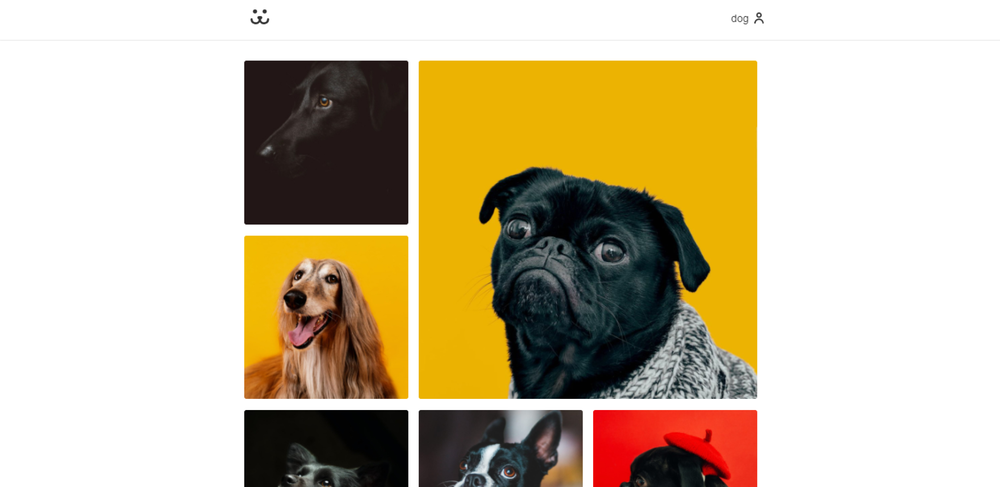

# Origamid's React Course Final Project - Dogs (with TS)

This project I made using `Typescript`, differently from the [course]("https://www.origamid.com/curso/react-completo/"), which was made with `Javascript`.
Dogs is a social network made for dogs. Hmm... actually it was made for dogs owners. Try it out right now.

## Get started with this project

To see this project working, run:

### `yarn`

To install all dependencies.

### `yarn start`

Runs the app in the development mode.\
Open [http://localhost:3000](http://localhost:3000) to view it in the browser.
